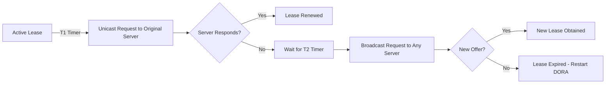

# Dynamic Host Configuration Protocol

---

## Table of Contents

1. [Core Concepts](#core-concepts)  
2. [Home Network Diagram](#home-network-diagram)  
3. [Scenario Workflows](#scenario-workflows)  
   - [1. Local Ping (Laptop → Smartphone)](#1-local-ping)  
   - [2. Remote Access (Laptop → Google.com)](#2-remote-access)  
   - [3. DHCP Lease Process](#3-dhcp-lease-process)  
4. [The DORA Process](#the-dora-process-how-a-device-gets-its-address)  
5. [Managing the Lease](#managing-the-lease-times-and-renewals)  
6. [DHCP Reservations](#dhcp-reservations-for-critical-devices)  
7. [How It All Fits Together](#how-it-all-fits-together)  

---

## Core Concepts

| Concept            | Definition & Format                                                                 | Purpose                                                    |
|--------------------|-------------------------------------------------------------------------------------|------------------------------------------------------------|
| **IP Address**     | - IPv4: 32-bit (e.g. `192.168.1.100`)  - IPv6: 128-bit (e.g. `2001:0db8::1`)      | Routes data across networks (like a postal address)        |
| **Subnet Mask**    | 32-bit mask (e.g. `255.255.255.0` or `/24`)  Splits IP into **Network ID + Host ID** | Determines if destination is local or needs routing       |
| **Default Gateway**| Router's IP on your subnet (e.g. `192.168.1.1`)                                    | Forwards off-net traffic to other networks (e.g., Internet) |
| **MAC Address**    | 48-bit hardware ID (e.g. `AA:BB:CC:DD:EE:FF`)                                      | Delivers frames on local network (Ethernet/Wi-Fi)         |
| **ARP**            | Maps IP ↔ MAC on same subnet                                                        | Enables Layer 2 communication by discovering MAC addresses |
| **DNS Server**     | Translates domain names (e.g. `google.com`) to IPs                                  | Bridges human-friendly names ↔ machine-usable IPs         |

> **Key Rule:**  
> If two devices share the same **Network ID**, they communicate directly.  
> Otherwise, they must use the **Default Gateway**.

---

## Home Network Diagram

| Device        | IP Address      | MAC Address         | Subnet Mask       | Default Gateway | DNS Server              |
|---------------|-----------------|---------------------|-------------------|-----------------|-------------------------|
| **Laptop**    | `192.168.1.100` | `AA:BB:CC:DD:EE:01` | `255.255.255.0`   | `192.168.1.1`   | `192.168.1.1` → `8.8.8.8` |
| **Smartphone**| `192.168.1.101` | `AA:BB:CC:DD:EE:02` | `255.255.255.0`   | `192.168.1.1`   | `192.168.1.1` → `8.8.8.8` |
| **Router**    | `192.168.1.1`   | `AA:BB:CC:DD:EE:03` | `255.255.255.0`   | `N/A`           | `8.8.8.8`                |

---

## Scenario Workflows

### 1. Local Ping

1. **Goal**  
   Laptop (`192.168.1.100`) pings Smartphone (`192.168.1.101`)

2. **Subnet Check**  
   - Laptop's Network ID:  

     ```bash
     192.168.1.100 AND 255.255.255.0 → 192.168.1.0
     ```  

   - Smartphone's Network ID:  

     ```bash
     192.168.1.101 AND 255.255.255.0 → 192.168.1.0
     ```  

   - ➔ **Same network** ⇒ direct communication

3. **ARP Resolution**  
   1. **Request:** Laptop broadcasts:  
      > *"Who has 192.168.1.101? Tell AA:BB:CC:DD:EE:01"*  
   2. **Reply:** Smartphone responds:  
      > *"192.168.1.101 is at AA:BB:CC:DD:EE:02"*

4. **Ethernet Frame**  

   ```plaintext
   Src MAC: AA:BB:CC:DD:EE:01  
   Dst MAC: AA:BB:CC:DD:EE:02  
   Payload: IP packet (192.168.1.100 → 192.168.1.101)
   ```

---

### 2. Remote Access

1. **Goal**  
   Browse `google.com` from laptop

2. **DNS Lookup**  
   1. Laptop → DNS Server (`192.168.1.1`)  
   2. Router → Google DNS (`8.8.8.8`)  
   3. Reply: `172.217.0.0`  

3. **Subnet Comparison**  
   - Local Network: `192.168.1.0/24`  
   - Target Network: `172.217.0.0/16`  
   - ➔ **Different network** ⇒ use gateway  

4. **ARP for Gateway**  

   ```plaintext
   "Who has 192.168.1.1?" → 
   "AA:BB:CC:DD:EE:03" (router)
   ```

5. **Frame to Router**  

   ```plaintext
   Src MAC: AA:BB:CC:DD:EE:01  
   Dst MAC: AA:BB:CC:DD:EE:03  
   IP Packet: 192.168.1.100 → 172.217.0.0
   ```

6. **Router Forwards**  
   - Strips Ethernet header  
   - Routes IP packet via public interface  

---

### 3. DHCP Lease Process

> *Auto-configuration of IP, mask, gateway, DNS*

| Step             | Description                                      |
|------------------|--------------------------------------------------|
| **DHCP Discover**| Client broadcasts: "Is there a DHCP server?"     |
| **DHCP Offer**   | Server proposes configuration: `IP: 192.168.1.100`, `Mask: 255.255.255.0`, `Gateway: 192.168.1.1`, `DNS: 192.168.1.1` |
| **DHCP Request** | Client confirms: "I'll take 192.168.1.100!"     |
| **DHCP ACK**     | Server finalizes lease                           |

---

## The DORA Process: How a Device Gets Its Address

> **D**iscover → **O**ffer → **R**equest → **A**cknowledgment

| Phase          | Technical Details                                                                 | Network Behavior              |
|----------------|-----------------------------------------------------------------------------------|-------------------------------|
| **Discover**   | Client sends `DHCPDISCOVER` broadcast  (Src MAC: `AA:BB:CC:DD:EE:01`, Dst MAC: `FF:FF:FF:FF:FF:FF`) | Floods local subnet           |
| **Offer**      | Server replies with `DHCPOFFER`  (Unicast/Broadcast with proposed IP config)    | Targets client's MAC address  |
| **Request**    | Client broadcasts `DHCPREQUEST`  (Formally requests offered IP)                 | Informs all DHCP servers      |
| **Ack**        | Server sends `DHCPACK`  (Confirms IP, subnet, gateway, DNS, lease time)        | Finalizes configuration      |

> **Why broadcasts?**  
>
> - Client has no IP initially → Uses `0.0.0.0` as source IP  
> - Destination: `255.255.255.255`  
> - ARP skipped until IP assignment completes  

---

## Managing the Lease: Times and Renewals

| Concept               | Default Duration | Purpose                                                                 | Technical Process                                                                 |
|-----------------------|------------------|-------------------------------------------------------------------------|-----------------------------------------------------------------------------------|
| **Lease Time**        | 24-48 hours      | Reclaim unused IPs; Prevent address exhaustion                         | Configured in router (e.g. `lease-time 86400` = 24 hours)                         |
| **T1 Timer (50%)**    | ~12 hours        | Initiate renewal with original server                                  | Unicast `DHCPREQUEST` to leasing server                                           |
| **T2 Timer (87.5%)**  | ~21 hours        | Seek ANY DHCP server if original unreachable                           | Broadcast `DHCPREQUEST` to any server                                             |
| **Lease Expiry**      | 24 hours         | Release IP; Restart DORA process                                       | Network access lost until new lease obtained                                       |

**Renewal Workflow**  



---

## DHCP Reservations for Critical Devices

> *Assign fixed IPs via MAC address binding*

**Why Use Reservations?**  

- Guarantee IP consistency for servers/printers  
- Avoid manual static IP configuration  
- Maintain DHCP management benefits  

**Configuration Workflow**  

1. Access router DHCP settings  
2. Add reservation entry:  

   ```yaml
   MAC: AA:BB:CC:DD:EE:01 → IP: 192.168.1.100
   MAC: AA:BB:CC:DD:EE:02 → IP: 192.168.1.101
   ```  

3. Set outside DHCP pool range (e.g. reserve `.100-.150`; DHCP pool: `.200-.250`)  

**Reservation vs. Static IP**  

| Feature               | DHCP Reservation       | Static IP Configuration      |
|-----------------------|------------------------|------------------------------|
| **Management**        | Centralized (router)   | Per-device                   |
| **Change Flexibility**| Update in one place    | Manual device reconfiguration|
| **MAC Binding**       | Required               | Not used                     |
| **DHCP Benefits**     | Keep DNS/gateway sync  | Lose automatic updates       |

---

## How It All Fits Together

1. **DHCP** → Assigns **IP**, **mask**, **gateway**, **DNS**  
2. **Subnet Mask** → Decides **local vs. remote** traffic  
3. **ARP** → Resolves **IP → MAC** for local delivery  
4. **Gateway** → Routes **off-net** packets  
5. **DNS** → Translates **names → IPs**  
6. **MAC** → Handles physical frame delivery  
7. **DORA** → Automated address assignment  
8. **Lease Management** → Dynamic IP recycling  
9. **Reservations** → Fixed IPs for critical devices  

> Together they ensure reliable network communication—whether assigning addresses, routing traffic, or maintaining device accessibility.
