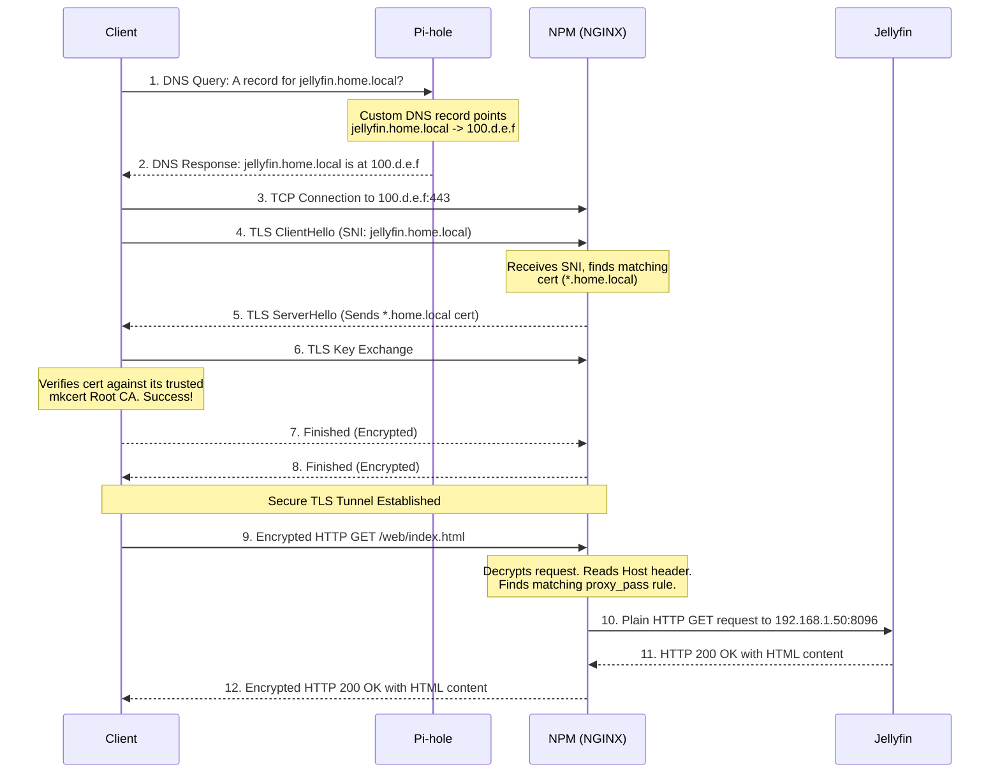

# Reverse Proxy and SSL

Welcome to your in-depth guide to building a modern, secure, and robust home server network. You've already built a solid foundation by understanding VPNs, Tailscale, DNS with Pi-hole, and DHCP. This guide will complete the picture by diving deep into the world of reverse proxies, SSL/TLS certificate management, and how these technologies integrate to create a seamless and secure experience for your self-hosted services.

We will cover the theory, the architecture of the tools you've chosen (Nginx Proxy Manager and mkcert), and a concrete, step-by-step example of how a request flows through your entire system.

-----

## 1\. Core Reverse-Proxy Concepts

At its heart, a reverse proxy is a traffic director for your servers. It sits in front of your web applications and forwards client requests (like a web browser) to the appropriate backend server. This simple concept provides powerful benefits.

### What Is a Reverse Proxy?

A reverse proxy is a server that retrieves resources on behalf of a client from one or more servers. These resources are then returned to the client, appearing as if they originated from the proxy server itself.

**Roles of a Reverse Proxy:**

* **Single Point of Entry:** Instead of exposing dozens of different services on different ports (e.g., `http://192.168.1.10:8080`, `http://192.168.1.10:9000`), a reverse proxy allows you to expose only one port (typically `443` for HTTPS). It then routes traffic to the correct internal service based on the hostname (`jellyfin.home.local`, `nextcloud.home.local`). This simplifies firewall rules and access management.
* **Load Balancing:** For high-traffic applications, a reverse proxy can distribute incoming requests across a pool of identical backend servers. This prevents any single server from being overwhelmed, improving performance and reliability. While less critical for a typical home server, this is a core enterprise function.
* **Security and Anonymity for Servers:** The reverse proxy acts as a shield. It hides the IP addresses and characteristics of your backend servers. Attackers can only see the proxy, making it harder to target vulnerabilities in specific applications. It can also handle all SSL/TLS encryption, offloading that work from your applications.
* **Caching:** A reverse proxy can cache static content (like images, CSS, and JS files). When a client requests this content, the proxy can serve it directly from its cache instead of requesting it from the backend server again, dramatically speeding up load times.
* **SSL Termination:** The proxy handles incoming HTTPS connections, decrypting the requests and forwarding them as unencrypted HTTP to the internal network. This centralizes certificate management and simplifies the configuration of backend applications, as they no longer need to handle encryption themselves.

**How it differs from a Forward Proxy:**

The key difference is who the proxy is serving.

* **Forward Proxy:** Serves the *client*. It sits between a user's machine and the public internet. Companies use it to filter employee web access, and individuals use it to bypass geo-restrictions or enhance anonymity. The server sees the request as coming from the proxy, not the client.
* **Reverse Proxy:** Serves the *server*. It sits between the public internet and a server farm. It directs client requests to the appropriate server. The client doesn't know it's talking to a proxy; it thinks it's communicating directly with the end server.

### HTTP Fundamentals

* **Request/Response Lifecycle:**
    1. A client (browser) opens a TCP connection to the server (your reverse proxy) on port 80 (HTTP) or 443 (HTTPS).
    2. The client sends an HTTP Request message. Key parts include the method (`GET`, `POST`), the path (`/login`), the HTTP version (`HTTP/1.1`), and headers.
    3. The server processes the request. The reverse proxy uses the `Host` header to decide which backend service to forward the request to.
    4. The backend server sends an HTTP Response back to the proxy. Key parts include the status code (`200 OK`, `404 Not Found`), headers, and the response body (HTML, JSON, etc.).
    5. The proxy forwards this response back to the original client.
* **Headers & Status Codes:**
  * **Headers:** Key-value pairs that carry metadata. The most important for a reverse proxy is the `Host` header, which contains the domain name the client is trying to reach (e.g., `Host: jellyfin.home.local`). This is how the proxy knows where to send the traffic.
  * **Status Codes:** `2xx` (Success), `3xx` (Redirection), `4xx` (Client Error), `5xx` (Server Error).
* **Connection Keep-Alive, Pipelining, HTTP/2:**
  * **Keep-Alive:** A header (`Connection: keep-alive`) that allows the TCP connection to remain open for multiple requests, avoiding the overhead of establishing a new connection for every single asset.
  * **Pipelining (HTTP/1.1):** Allows a client to send multiple requests without waiting for each response. However, the responses must come back in the same order. It was complex and has been largely superseded.
  * **HTTP/2:** A major revision. It uses a single TCP connection for all requests to a host and allows for *multiplexing*—sending multiple requests and receiving responses in any order. This is much more efficient and is fully supported by Nginx.

### Proxying Mechanics

* **`proxy_pass`:** This is the core Nginx directive. It defines the backend (or "upstream") server to which the request should be forwarded. Example: `proxy_pass http://192.168.1.50:3000;`.
* **Upstream Pools:** When you have multiple backend servers for load balancing, you define them in an `upstream` block and then `proxy_pass` to the name of the pool. Nginx can then use algorithms like round-robin to distribute requests.
* **Health Checks:** Nginx can periodically send requests to the upstream servers to check if they are "healthy." If a server fails the health check, Nginx stops sending traffic to it until it recovers.
* **Streaming vs. Buffering:**
  * **Buffering (Default):** Nginx reads the entire response from the backend server into memory (a buffer) before it starts sending it to the client. This is good for slow clients, as the backend server can quickly send its response and close the connection, freeing it up for other tasks.
  * **Streaming (Buffering Off):** Nginx sends the response to the client in real-time as it receives it from the backend. This is essential for long-lived connections like video streaming or WebSockets, where you want low latency and can't wait for the entire response to be generated.
* **Timeouts, Buffers, Rate Limiting:** Nginx gives you granular control over timeouts (how long to wait for a backend response), buffer sizes, and rate limiting (how many requests a client can make in a given period) to protect your services from abuse or misconfiguration.

### Name-based vs. IP-based Virtual Hosting

* **IP-based:** An older method where each website required a unique IP address. The server would listen on a specific IP and serve the site associated with it. This is inefficient and costly due to the scarcity of IPv4 addresses.
* **Name-based (Modern Standard):** Multiple websites can be hosted on a single IP address. This is what you will be using.
  * **How it works (HTTP):** The client sends the `Host` header in its request (e.g., `Host: jellyfin.home.local`). Nginx reads this header.
  * **How it works (HTTPS):** Before the encrypted HTTP request is sent, the client's browser uses an extension to TLS called **Server Name Indication (SNI)**. During the TLS handshake, the client tells the server which hostname it wants to connect to. This allows the server to select and present the correct SSL certificate *before* the encrypted part of the conversation begins.
  * **Nginx Directives:** The `listen` directive tells Nginx which IP/port to listen on (e.g., `listen 443 ssl;`), and the `server_name` directive specifies which hostnames this server block should handle (e.g., `server_name jellyfin.home.local;`).

-----

## 2\. NGINX Proxy Manager (NPM) Architecture

Nginx Proxy Manager (NPM) is a fantastic tool that puts a user-friendly graphical interface on top of the powerful but complex Nginx. It's designed to make managing proxy hosts and SSL certificates incredibly simple.

### NPM Components

NPM is delivered as a set of Docker containers, orchestrated by `docker-compose`. A typical setup includes:

* **`nginx-proxy-manager-app`:** The main container. It contains:
  * **Admin GUI:** A web-based interface built with Node.js that you interact with. This is where you define your proxy hosts, users, and SSL settings.
  * **Backend API:** An API that the GUI talks to. When you save a change in the GUI, it sends an API request to this backend.
  * **Configuration Generator:** The "magic" of NPM. The backend takes your inputs from the GUI, queries its database, and generates the raw Nginx configuration files (`.conf`) that Nginx needs to operate.
  * **OpenResty (Nginx):** A customized version of Nginx that is used to run the proxy itself.
* **`nginx-proxy-manager-db`:** A database container, typically running MariaDB (a fork of MySQL). This is where all your configuration is persistently stored—proxy host definitions, users, SSL certificate details, access lists, etc.
* **`watchtower` (Optional):** A popular companion container that can automatically update your other containers to the latest versions.

### How NPM Generates `nginx.conf`

This is the core workflow:

1. **User Action:** You create a new proxy host in the GUI, mapping `jellyfin.home.local` to `192.168.1.50:8096`.
2. **API & Database:** The GUI sends this information to the backend API, which stores the new host definition in the MariaDB database.
3. **Config Generation:** The backend logic queries the database for all active host configurations. It then runs a template engine that translates this structured data into a valid `nginx.conf` file. This file is written to a location that the Nginx process can read (e.g., `/data/nginx/proxy_host/1.conf`).
4. **Nginx Reload:** After writing the new configuration, NPM sends a signal to its internal Nginx process to gracefully reload the configuration (`nginx -s reload`). This applies the changes without dropping existing connections.

### Configuration Storage

All of NPM's persistent data is stored in volumes mapped from your host machine into the Docker containers.

* **`/data`:** This is the most critical volume. It contains:
  * The SQLite database (if not using the MariaDB container).
  * All generated Nginx configuration snippets.
  * Custom SSL certificates that you upload.
  * Access logs.
* **`/etc/letsencrypt`:** This volume stores all certificates obtained automatically from Let's Encrypt.

By mapping these directories to your host's filesystem, your configuration survives container restarts and upgrades.

### Customization & Overrides

NPM provides a "Custom NGINX Configuration" tab for each proxy host. This allows you to insert your own directives into the `server { ... }` block that NPM generates. This is extremely powerful for advanced use cases not covered by the GUI, such as:

* Adding specific security headers.
* Setting up custom caching rules.
* Configuring WebSocket support (though NPM now has a simple toggle for this).

### Scaling & High Availability

For a typical home lab, a single NPM instance is more than sufficient. However, in an enterprise context, you could achieve high availability by:

* Running multiple NPM instances on different servers.
* Pointing all instances to a shared, external (and redundant) database.
* Placing them behind a Layer 4 load balancer.

-----

## 3\. SSL/TLS Deep Dive

SSL (Secure Sockets Layer) is the predecessor to TLS (Transport Layer Security). We almost exclusively use TLS today, but the terms are often used interchangeably. TLS provides the "S" in "HTTPS," encrypting the communication between a client and a server.

### TLS Handshake Walkthrough

The handshake is a negotiation process that happens in milliseconds before any HTTP data is exchanged.

**Goal:** For the client and server to agree on an encryption key (a "session key") that only they know, and to do so over an insecure channel.

**Simplified Steps:**

1. **ClientHello:** The client says "hello" and sends a list of the TLS versions and cipher suites (encryption algorithms) it supports. If it's using SNI, it also includes the hostname it's trying to reach (`jellyfin.home.local`).
2. **ServerHello:** The server (NPM) looks at the client's list, picks the strongest TLS version and cipher suite that it also supports, and says "hello back." It also sends its SSL certificate.
3. **Certificate Verification:** The client examines the server's certificate. It checks:
      * Is the domain name on the certificate (`*.home.local`) valid for the server it's trying to reach (`jellyfin.home.local`)?
      * Is the certificate expired?
      * Is the certificate signed by a Certificate Authority (CA) that the client's operating system or browser trusts? (This is the key step where `mkcert` comes in).
4. **Key Exchange:** The client and server use the public/private key pair from the server's certificate to securely generate a symmetric session key. This is the key that will be used to encrypt all the application data for the rest of the session. The exact mechanism differs between TLS versions.
5. **Finished:** Both client and server exchange a "Finished" message, which is encrypted with the new session key. If both can decrypt the other's message, the handshake is successful.
6. **Encrypted Application Data:** Now that a secure channel is established, the client sends its HTTP request, encrypted with the session key.

**TLS 1.2 vs. 1.3 Differences:**

* **Speed:** TLS 1.3 is faster. It reduced the number of round-trips required for the handshake from two to one for new connections, and even offers a zero round-trip mode (0-RTT) for subsequent connections.
* **Security:** TLS 1.3 removed older, insecure cryptographic algorithms (like MD5, SHA-1) and made modern, secure ciphers mandatory.

### Certificates & Trust Chains

A certificate is a digital file that proves ownership of a public key. Trust isn't based on the certificate itself, but on who signed it.

* **Leaf Certificate (or End-Entity Certificate):** This is the certificate installed on your server (NPM). It's issued for your specific domain(s) (e.g., `*.home.local`).
* **Intermediate CA:** To avoid keeping the ultra-sensitive root keys online, Root CAs issue certificates to a smaller number of Intermediate CAs. These Intermediates are then used to sign the millions of leaf certificates.
* **Root CA (Certificate Authority):** This is the ultimate source of trust. A Root CA is an organization (like DigiCert, Sectigo, or in our case, your own `mkcert` CA) whose public certificate is pre-installed and trusted by default in the "trust store" of your operating system and browser.

**How Trust is Established:** When your browser receives the leaf certificate from NPM, it also receives the intermediate certificate. The browser then performs this check:
"Okay, `jellyfin.home.local`'s certificate was signed by 'My `mkcert` Intermediate CA'. And I see that 'My `mkcert` Intermediate CA' certificate was signed by 'My `mkcert` Root CA'. I have 'My `mkcert` Root CA' in my trusted list, so I trust the entire chain."

### Certificate Formats

* **PEM (.pem, .crt, .cer, .key):** The most common format. It's a Base64-encoded text file. You can open it in a text editor and see blocks like `-----BEGIN CERTIFICATE-----`. A PEM file can contain just the public certificate, just the private key, or even the entire trust chain. NPM uses PEM format.
* **DER (.der, .cer):** A binary format for certificates. It's not human-readable. PEM is just a Base64-encoded version of DER.
* **PKCS\#12 (.p12, .pfx):** A password-protected container format that can bundle the public certificate, the entire trust chain, AND the corresponding private key into a single, encrypted file. This is often used on Windows systems or for securely moving certificates between systems.

### OCSP / CRL (Revocation)

What happens if a private key is stolen? The certificate needs to be revoked.

* **CRL (Certificate Revocation List):** A literal list, published by the CA, of all serial numbers of revoked certificates. A browser would have to download this potentially huge list to check it. It's slow and not privacy-preserving.
* **OCSP (Online Certificate Status Protocol):** A more modern mechanism. The browser sends the serial number of the certificate it's checking to an OCSP server run by the CA, which returns a "good," "revoked," or "unknown" status.
* **OCSP Stapling:** To improve speed and privacy, the web server (Nginx) can query the OCSP server itself periodically and "staple" the fresh, timestamped OCSP response to the certificate it sends to the client during the TLS handshake. This saves the client from having to make a separate connection. Nginx and NPM support OCSP stapling.

-----

## 4\. Certificate Management with mkcert

For a public-facing website, you would use Let's Encrypt to get a globally trusted certificate. But for your internal, `.local` domain, Let's Encrypt cannot issue a certificate. This is the perfect use case for `mkcert`.

### How mkcert Works

`mkcert` is a simple tool that does two things:

1. **Local CA Generation:** The first time you run `mkcert -install`, it generates a new private Root CA. It creates a root certificate and its corresponding private key.
2. **Trust Store Installation:** This is the magic step. `mkcert` then automatically finds the local trust stores for your operating system (and any browsers like Firefox that use their own) and **installs its own root certificate into them**. Your computer is now configured to trust any certificate signed by your new local Root CA.

After the one-time install, generating leaf certificates is easy:

```bash
# Generate a wildcard certificate valid for any subdomain of home.local
mkcert "*.home.local"
```

This command will create two files:

* `_wildcard.home.local.pem`: The public certificate (leaf).
* `_wildcard.home.local-key.pem`: The private key.

These are the two files you will upload to Nginx Proxy Manager.

### Trust Stores Across Devices

For your server and the computer where you ran `mkcert -install`, everything will just work. But to access `jellyfin.home.local` from your phone or another laptop without getting a security warning, you must also make those devices trust your `mkcert` CA.

1. **Find the Root CA file:** Run `mkcert -CAROOT` to find the path where your root CA certificate is stored (it's usually named `rootCA.pem`).
2. **Copy `rootCA.pem` to other devices:** Use any method (USB, network share, etc.) to get this file onto your other devices.
3. **Install the CA:**
      * **Windows:** Double-click the `rootCA.pem` file, click "Install Certificate," choose "Local Machine," and manually place it in the "Trusted Root Certification Authorities" store.
      * **macOS:** Double-click the `rootCA.pem` file to open it in Keychain Access. Drag it to the "System" keychain. Then, double-click the certificate in Keychain Access, expand "Trust," and set "When using this certificate" to "Always Trust."
      * **Linux:** The process varies by distribution, but it typically involves placing the `.pem` file in `/usr/local/share/ca-certificates/` and running `sudo update-ca-certificates`.
      * **Android/iOS:** You can email the `rootCA.pem` file to yourself. Opening the attachment will prompt you to install the certificate profile. You will then need to go into the security settings to manually enable full trust for the new root CA.

### Automating Renewal

* **`mkcert` does not auto-renew certificates.** The certificates it generates have a long lifespan (around 27 months), so this is not a frequent task.
* **Renewal is a manual process:** You simply run the same `mkcert "*.home.local"` command again to generate a new certificate and key, then re-upload them to NPM.
* **Comparison to ACME/Let's Encrypt:** Let's Encrypt certificates last for only 90 days, so automated renewal is essential. The ACME protocol and clients like `certbot` are designed specifically for this automated, frequent renewal cycle. For your internal `.local` domain, the manual nature of `mkcert` is a perfectly acceptable trade-off for its simplicity.

-----

## 5\. Integrating SSL into NPM

Now let's connect the `mkcert`-generated certificates to your reverse proxy.

### Importing Custom Certs

1. In the NPM web UI, navigate to `SSL Certificates` \> `Add SSL Certificate` \> `Custom`.
2. Give it a `Nickname` (e.g., "home.local Wildcard").
3. Open your `_wildcard.home.local.pem` file in a text editor, copy the entire contents (including the `-----BEGIN...` and `-----END...` lines), and paste it into the `Certificate Key` box in NPM.
4. Do the same for your `_wildcard.home.local-key.pem` file, pasting its contents into the `Private Key` box.
5. (Optional but recommended) Your `mkcert` certificate doesn't have an intermediate, but if you were using a commercial certificate, you would paste the intermediate/chain certificate into the `Intermediate Certificate` box.
6. Click `Save`.

### Enabling HTTPS in NPM

1. Go to `Hosts` \> `Proxy Hosts` and edit the host you want to secure (e.g., `jellyfin.home.local`).
2. Click on the `SSL` tab.
3. In the `SSL Certificate` dropdown, select the custom certificate you just uploaded ("home.local Wildcard").
4. **Strongly Recommended:**
      * Toggle on **`Force SSL`**. This automatically creates a redirect from HTTP to HTTPS.
      * Toggle on **`HTTP/2 Support`**. This enables the performance benefits of HTTP/2.
      * Toggle on **`HSTS Enabled`**. This sends a security header to browsers telling them to *only* connect to your site over HTTPS in the future, preventing downgrade attacks.
5. Click `Save`.

### Troubleshooting TLS

If you get a certificate error in your browser after setting this up, here are the most common causes and how to check them:

* **Common Error: "Certificate Not Trusted"**
  * **Cause:** The device you are using (your phone, laptop) does not have your `mkcert` Root CA installed and trusted.
  * **Fix:** Follow the steps in section 4 to install the `rootCA.pem` file on that specific device.
* **Common Error: "Certificate Name Mismatch" (CN/SAN Mismatch)**
  * **Cause:** You are accessing a URL that is not covered by the certificate. For example, trying to access `nas.local` when your certificate is only for `*.home.local`.
  * **Fix:** Ensure the URL in your browser's address bar matches the domain name on the certificate you created and assigned in NPM.
* **Troubleshooting Tools:**
  * **Browser Dev Tools:** The "Security" tab in Chrome DevTools provides excellent details about the connection, including the certificate chain being presented by the server.
  * **`openssl s_client`:** A command-line tool to diagnose TLS issues.

    ```bash
    # Connect to your server and print the certificate details
    openssl s_client -connect jellyfin.home.local:443 -servername jellyfin.home.local
    ```

  * **SSL Labs Scanner:** An invaluable public tool for *internet-facing* sites. It cannot be used for your internal `.local` domains.

-----

## 6\. Concrete Request Flow Example: Accessing `jellyfin.home.local`

Let's trace the entire journey of a single request from your laptop (which is on the same Tailscale network as your server) to your Jellyfin container.

**Scenario:**

* **Client:** Your laptop (`100.x.y.z`)
* **DNS Server:** Your Pi-hole (`100.a.b.c`)
* **Home Server running Docker:** (`100.d.e.f`)
  * Nginx Proxy Manager is listening on port `443`.
  * Jellyfin container is running internally at `192.168.1.50:8096`.
* All devices are connected via Tailscale. You've configured Pi-hole to be the DNS server for your tailnet.

<!-- end list -->



**Step-by-Step Breakdown:**

1. **DNS Lookup:** You type `https://jellyfin.home.local` into your browser. Your laptop sends a DNS query to your Pi-hole (as configured by Tailscale).
2. **DNS Response:** You have a "Custom DNS" entry in Pi-hole that maps `jellyfin.home.local` to the Tailscale IP of your home server (`100.d.e.f`). Pi-hole returns this IP address.
3. **TCP Connection:** Your browser opens a TCP connection to `100.d.e.f` on port `443`. Tailscale routes this traffic directly and securely to your home server.
4. **TLS Handshake Start:** Your browser initiates the TLS handshake, sending a `ClientHello`. Crucially, this message contains the `Server Name Indication` field, telling NPM that it wants to talk to `jellyfin.home.local`.
5. **NPM Presents Certificate:** NPM receives the handshake request. It uses the SNI information to look through its configured hosts. It finds the host entry for `jellyfin.home.local` and sees that it's configured to use the `*.home.local` certificate. It sends this certificate back to your browser.
6. **Client Verifies & Key Exchange:** Your browser checks the certificate. It sees it was signed by your `mkcert` CA, which you previously installed in your OS trust store. The check passes. The browser and NPM then perform the key exchange to create a shared secret session key.
7. **Handshake Finished:** The secure tunnel is established.
8. **Encrypted Request:** Your browser sends the actual HTTP `GET` request, but it's fully encrypted with the new session key.
9. **Proxy Decrypts and Routes:** NPM receives the encrypted request and decrypts it using the same session key. It can now see the plain HTTP request inside, including the header `Host: jellyfin.home.local`. It looks up its proxy rules and finds the one that says to forward requests for this host to the upstream `http://192.168.1.50:8096`.
10. **Internal Request:** NPM makes a *new, unencrypted* HTTP request to the Jellyfin container on its internal Docker network address.
11. **Internal Response:** Jellyfin processes the request and sends the HTML page back to NPM as a standard HTTP response.
12. **Proxy Encrypts and Returns:** NPM receives the response from Jellyfin, encrypts it with the session key, and sends it back to your browser over the secure tunnel. Your browser decrypts it and renders the page.

-----

## 7\. Firewall & Port Forwarding with Tailscale

**Because you are using Tailscale, you do not need to set up any port forwarding on your router.** This is one of the biggest advantages of a mesh VPN, especially when you are behind CGNAT.

* **How Tailscale Bypasses CGNAT:** Tailscale uses a technique called **NAT Traversal**. When your home server and your laptop connect to Tailscale, they both establish persistent outbound connections to Tailscale's coordination servers. When your laptop wants to connect to your server, the coordination servers "introduce" them to each other. Using clever techniques (like STUN/TURN, sometimes called "hole punching"), they help the two devices establish a direct, peer-to-peer, encrypted connection.
* **Your Firewall:** You do not need to open port `443` on your router's firewall to the internet. Your server remains completely invisible to the public internet. The only "firewall" you need to worry about is the host firewall on the server itself (e.g., `ufw` on Linux). You must ensure that this host firewall allows incoming traffic on port `443` *from the Tailscale network interface* (`tailscale0`). Tailscale's own documentation provides clear instructions for this.

-----

## 8\. Advanced & Optional Topics

### Let’s Encrypt / ACME

* **Why Switch?** If you ever decide to expose a service to the public internet (not just on your tailnet), you should switch from `mkcert` to Let's Encrypt for that service. This is because you can't (and shouldn't) ask random visitors to install your personal `mkcert` Root CA. Let's Encrypt CAs are trusted globally by default.
* **Challenges with CGNAT:** The most common Let's Encrypt challenge is `HTTP-01`, where the Let's Encrypt server tries to connect to your server on port 80 to verify you own the domain. This is impossible behind CGNAT.
* **The Solution: `DNS-01` Challenge:** You can prove domain ownership by creating a specific `TXT` record in your public DNS settings. NPM has excellent support for the `DNS-01` challenge and integrates with dozens of DNS providers (like Cloudflare, Namecheap, etc.). You provide NPM with an API key for your DNS provider, and when it's time to issue or renew a certificate, NPM will automatically create the required `TXT` record, complete the challenge, and then remove the record. This works perfectly even when behind CGNAT.

### Dynamic DNS

If you were exposing services to the public internet without a static IP, you would need a Dynamic DNS (DDNS) service to keep your domain name (`my-server.ddns.net`) pointing to your changing home IP address. **With Tailscale, DDNS is largely irrelevant.** Your services are reached via their stable Tailscale IP (`100.x.y.z`) or MagicDNS name, which doesn't change.

### Edge Cases: WebSocket Proxying

Applications that require real-time, two-way communication (like chat apps, live monitoring dashboards, or some text editors) use WebSockets. A standard Nginx `proxy_pass` will break these connections. To properly proxy WebSockets, you must instruct Nginx to pass along specific "Upgrade" headers from the client.

NPM makes this trivial. In the "Advanced" tab of a proxy host, you can simply paste the standard Nginx snippet for this, but even better, there is now a **"WebSocket Support" toggle** on the "Details" tab of a proxy host which handles this for you.

### Zero-Trust Networking

The setup you are building is a perfect example of a Zero-Trust network philosophy.

* **Old Model ("Castle and Moat"):** Trust everything *inside* the firewall, distrust everything *outside*. This is flawed; if an attacker gets inside, they can move around freely.
* **Zero-Trust Model:** Trust no one by default. Authenticate and authorize every single connection.
* **How Your Setup Achieves This:**
  * **Authentication:** Tailscale ensures that only devices you have explicitly authorized (by logging them into your account) can even join the network. This is the new perimeter.
  * **Encryption:** All traffic between your devices on the tailnet is end-to-end encrypted by WireGuard.
  * **Internal Segmentation:** Even though the traffic is on the secure tailnet, NPM acts as another checkpoint. It provides a single, audited entry point (port `443`) and TLS encryption for all your applications, hiding the internal network topology (`192.168.1.x`). You can even use NPM's Access Lists to require a separate login before the proxy will even forward the request to the final application, adding another layer of authorization.

By combining Tailscale, Pi-hole (for DNS control), and NPM, you are building a home network that is more secure, flexible, and powerful than most traditional setups.
